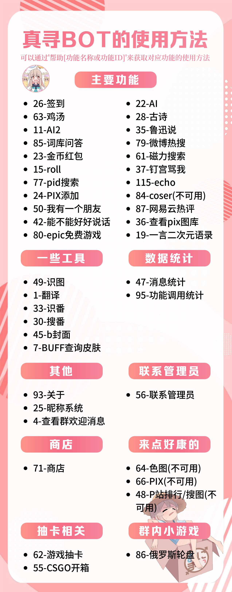
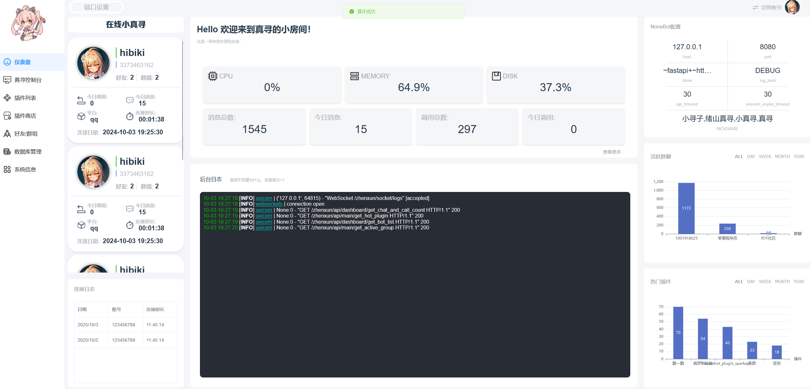
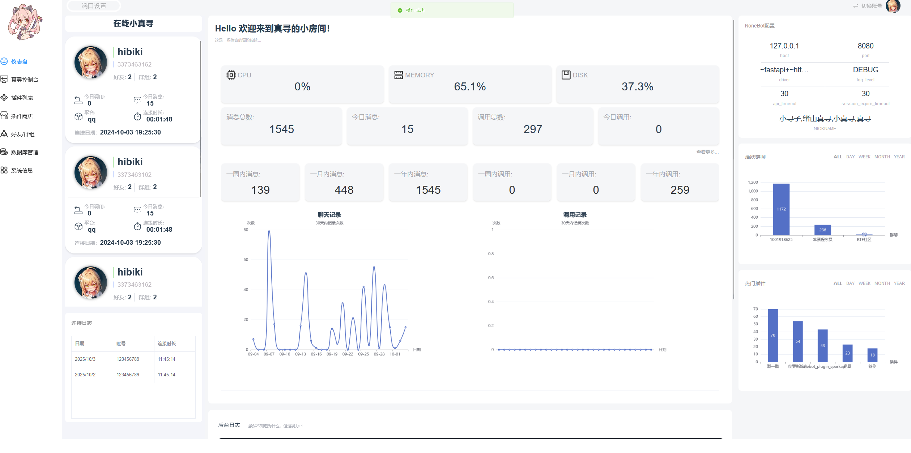
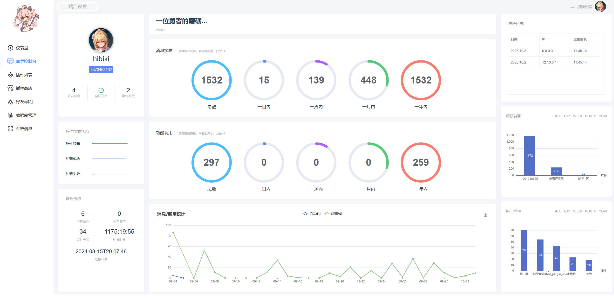
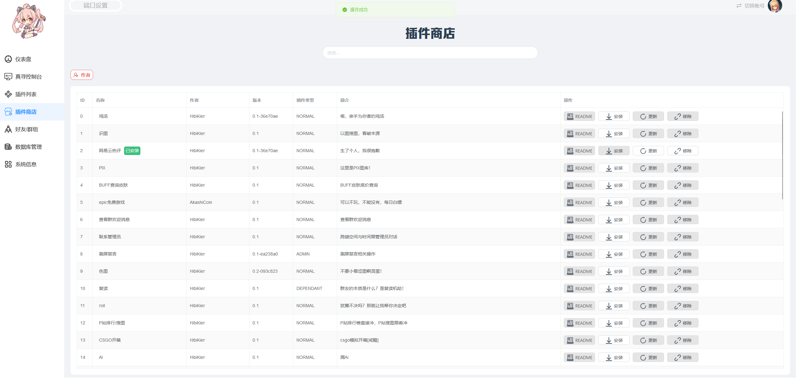
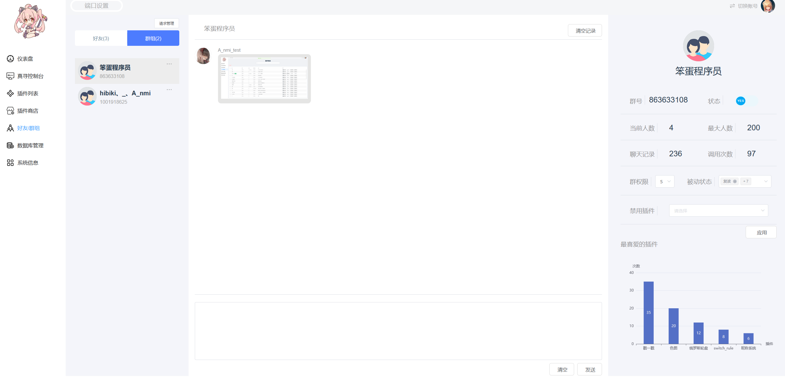
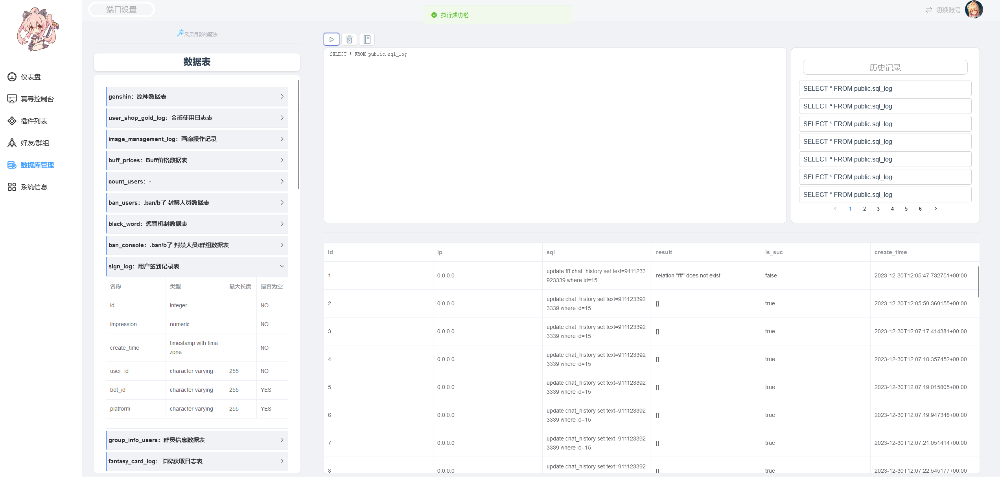
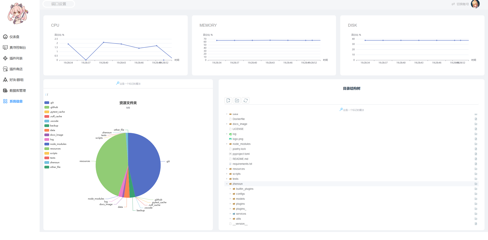

<!-- markdownlint-disable MD033 MD041 -->
<div align=center>


</div>

<div align=center>
<a href="./LICENSE">
    
</a>
<a href="https://www.python.org">
    
</a>
<a href="https://nonebot.dev/">
    
</a>
<a href="https://onebot.dev/">
  
</a>
<a href="https://onebot.dev/">
  
</a>
<a href="https://bot.q.qq.com/wiki/">
  
</a>
<a href="https://github.com/psf/black">
  
</a>
<a href="https://github.com/Microsoft/pyright">
  
</a>
<a href="https://github.com/astral-sh/ruff">
  
</a>
</div>

<div align=center>

[](https://jq.qq.com/?_wv=1027&k=u8PgBkMZ)
[](https://qm.qq.com/q/YYYt5rkMYc)

</div>

<div align=center>

[文档](https://hibikier.github.io/zhenxun_bot/)

</div>

<div align=center>

## 绪山真寻 Bot

</div>

<div align=center>

“真寻是<strong>[椛椛](https://github.com/FloatTech/ZeroBot-Plugin)</strong>的好朋友！”

🎉喜欢真寻，于是真寻就来了！🎉

本项目符合 [OneBot](https://github.com/howmanybots/onebot) 标准，可基于以下项目与机器人框架/平台进行交互

|                           项目地址                            | 平台 |         核心作者         | 备注 |
| :-----------------------------------------------------------: | :--: | :----------------------: | :--: |
|       [LLOneBot](https://github.com/LLOneBot/LLOneBot)        | NTQQ |        linyuchen         | 可用 |
|         [Napcat](https://github.com/NapNeko/NapCatQQ)         | NTQQ |         NapNeko          | 可用 |
| [Lagrange.Core](https://github.com/LagrangeDev/Lagrange.Core) | NTQQ | LagrangeDev/Linwenxuan04 | 可用 |

</div>

<div align=center>


</div>

## 🤝 帮助页面

<details>
<summary>点击展开查看图片</summary>
  
  
  
</details>

## 📦 这是一份扩展

### 1. 体验一下？

这是一个免费的，版本为 dev 的 zhenxun，你可以通过 [napcat](https://github.com/NapNeko/NapCatQQ) 或 [拉格朗日](https://github.com/LagrangeDev/Lagrange.Core) 以及 [matcha](https://github.com/A-kirami/matcha) 等直接连接用于体验与测试  
（球球了测试君！）

```text
Url: ws://test.zhenxun.org:8080/onebot/v11/ws
AccessToken: PUBLIC_ZHENXUN_TEST

注：你无法获得超级用户权限
```

### 2. 额外扩展

<div align=center>
  
“不要害怕，你的背后还有千千万万的 <strong>伙伴</strong> 啊！”

|                                项目名称                                | 主要用途 |                      仓库作者                       |             备注              |
| :--------------------------------------------------------------------: | :------: | :-------------------------------------------------: | :---------------------------: |
|      [插件库](https://github.com/zhenxun-org/zhenxun_bot_plugins)      |   插件   |    [zhenxun-org](https://github.com/zhenxun-org)    |     原 plugins 文件夹插件     |
| [插件索引库](https://github.com/zhenxun-org/zhenxun_bot_plugins_index) |   插件   |    [zhenxun-org](https://github.com/zhenxun-org)    |        扩展插件索引库         |
|    [一键安装](https://github.com/soloxiaoye2022/zhenxun_bot-deploy)    |   安装   | [soloxiaoye2022](https://github.com/soloxiaoye2022) |            第三方             |
|         [WebUi](https://github.com/HibiKier/zhenxun_bot_webui)         |   管理   |       [hibikier](https://github.com/HibiKier)       | 基于真寻 WebApi 的 webui 实现 [预览](#-webui界面展示) |
|  [安卓 app(WebUi)](https://github.com/YuS1aN/zhenxun_bot_android_ui)   |   安装   |         [YuS1aN](https://github.com/YuS1aN)         |            第三方             |

</div>

## 🥰 ~~来点优点？~~ 可爱难道还不够吗

- 实现了许多功能，且提供了大量功能管理命令，进行了多平台适配，兼容 nb2 商店插件
- 拥有完善可用的 webui
- 通过 Config 配置项将所有插件配置统计保存至 config.yaml，利于统一用户修改
- 方便增删插件，原生 nonebot2 matcher，不需要额外修改，仅仅通过简单的配置属性就可以生成`帮助图片`和`帮助信息`
- 提供了 cd，阻塞，每日次数等限制，仅仅通过简单的属性就可以生成一个限制，例如：`PluginCdBlock` 等
- **更多详细请通过[传送门](https://hibikier.github.io/zhenxun_bot/)查看文档！**

## 🛠️ 简单部署

```bash
# 获取代码
git clone https://github.com/HibiKier/zhenxun_bot.git

# 进入目录
cd zhenxun_bot

# 安装依赖
pip install poetry      # 安装 poetry
poetry install          # 安装依赖

# 开始运行
poetry shell            # 进入虚拟环境
python bot.py           # 运行机器人
```

## 📝 简单配置

1.在 .env.dev 文件中填写你的机器人配置项

2.在 configs/config.yaml 文件中修改你需要修改的插件配置项

> [!TIP]
> config.yaml 需要启动一次 Bot 后生成

<details>
<summary>数据库地址（DB_URL）配置说明</summary>
DB_URL 是基于 Tortoise ORM 的数据库连接字符串，用于指定项目所使用的数据库。以下是 DB_URL 的组成部分以及示例：

格式为： ```<数据库类型>://<用户名>:<密码>@<主机>:<端口>/<数据库名>?<参数>```

说明

- <数据库类型>：表示数据库类型，例如 postgres、mysql、sqlite 等。
- <用户名>：数据库的用户名，例如 root。
- <密码>：数据库的密码，例如 123456。
- <主机>：数据库的主机地址，例如 127.0.0.1（本地）或远程服务器 IP。
- <端口>：数据库的端口号，例如：PostgreSQL：5432, MySQL：3306
- <数据库名>：指定要使用的数据库名称，例如 zhenxun。
- <参数>（可选）：用于传递额外的配置，例如字符集设置。

</details>

## 📋 功能列表

> [!NOTE]
> 真寻原 `plugins` 插件文件夹已迁移至 [插件仓库](https://github.com/zhenxun-org/zhenxun_bot_plugins) ，现在本体仅保留核心功能

<details>
<summary>内置功能</summary>

### 🔧 基础功能

- 昵称系统（群与群与私聊分开）
- 签到/我的签到/好感度排行/好感度总排行（影响色图概率和开箱次数，支持配置）
- 商店/我的金币/购买道具/使用道具/金币排行（完整的商店添加/购买/使用流程）
- 查看当前群欢迎消息
- 个人信息查看（群组内权限，聊天频率等）
- 消息撤回
- 功能统计可视化
- 关于
- 三种样式的帮助菜单

### 🛠️ 管理员功能

- 管理员帮助
- 更新群组成员信息
- 95%的群功能开关
- 查看群内被动技能状态
- 自定义群欢迎消息（是真寻的不是管家的！）
- ban/unban（支持设置 ban 时长）= 群组及用户的黑名单
- 休息吧/醒来（群组内真寻状态）

### 🧑‍💼 超级用户功能

- 超级用户帮助
- 添加/删除权限（是真寻的管理员权限，不是群管理员）
- 群组管理，退群指令等
- 广播
- 自检（检查系统状态）
- 所有群组/所有好友
- 退出指定群
- 更新好友信息/更新群信息
- 修改群权限
- 检查更新
- 重启
- 添加/删除/查看群白名单
- 功能开关(更多设置)
- 功能状态
- 执行 SQL
- 重载配置
- 清理临时数据
- 增删群认证
- 同意/拒绝好友/群聊请求
- 添加/移除/更新插件/插件商店（plugins 库以及扩展库）
- WebUI API（对真寻前端的支持）

#### 🛡️ 超级用户的被动技能

- 邀请入群提醒(别人邀请真寻入群，可配置自动同意)

- 添加好友提醒(别人添加真寻好友，可配置自动同意)

### 🤖 被动技能

- 群早晚安

### 👻 看不见的技能

- 功能调用统计
- 聊天记录统计
- 检测恶意触发命令（将被最高权限 ban 掉 30 分钟，只有最高权限(9 级)可以进行 unban）
- 自动同意好友/群组请求，加群请求将会提醒管理员，退群提示，加群欢迎等等
- 群聊时间检测（当群聊最后一人发言时间大于当前 48 小时后将关闭该群所有通知（即被动技能））
- 群管理员监控，自动为新晋管理员增加权限，为失去群管理员的用户删除权限
- 群权限系统
- 定时更新权限
- 自动配置重载
- 强制入群保护
- 自定备份（可配置）
- 笨蛋检测（当使用功能名称当指令时真寻会跳出来狠狠嘲笑并帮助）

</details>

## 💖 赞助

<details>
<summary>爱发电</summary>
<a href="https://afdian.com/a/HibiKier">

</a>
</details>

### 赞助名单

(可以告诉我你的 **github** 地址，我偷偷换掉 0v|)

[shenqi](https://afdian.net/u/fa923a8cfe3d11eba61752540025c377) [A_Kyuu](https://afdian.net/u/b83954fc2c1211eba9eb52540025c377) [疯狂混沌](https://afdian.net/u/789a2f9200cd11edb38352540025c377) [投冥](https://afdian.net/a/144514mm) [茶喵](https://afdian.net/u/fd22382eac4d11ecbfc652540025c377) [AemokpaTNR](https://afdian.net/u/1169bb8c8a9611edb0c152540025c377) [爱发电用户\_wrxn](https://afdian.net/u/4aa03d20db4311ecb1e752540025c377) [qqw](https://afdian.net/u/b71db4e2cc3e11ebb76652540025c377) [溫一壺月光下酒](https://afdian.net/u/ad667a5c650c11ed89bf52540025c377) [伝木](https://afdian.net/u/246b80683f9511edba7552540025c377) [阿奎](https://afdian.net/u/da41f72845d511ed930d52540025c377) [醉梦尘逸](https://afdian.net/u/bc11d2683cd011ed99b552540025c377) [Abc](https://afdian.net/u/870dc10a3cd311ed828852540025c377) [本喵无敌哒](https://afdian.net/u/dffaa9005bc911ebb69b52540025c377) [椎名冬羽](https://afdian.net/u/ca1ebd64395e11ed81b452540025c377) [kaito](https://afdian.net/u/a055e20a498811eab1f052540025c377) [笑柒 XIAO_Q7](https://afdian.net/u/4696db5c529111ec84ea52540025c377) [请问一份爱多少钱](https://afdian.net/u/f57ef6602dbd11ed977f52540025c377) [咸鱼鱼鱼鱼](https://afdian.net/u/8e39b9a400e011ed9f4a52540025c377) [Kafka](https://afdian.net/u/41d66798ef6911ecbc5952540025c377) [墨然](https://afdian.net/u/8aa5874a644d11eb8a6752540025c377) [爱发电用户\_T9e4](https://afdian.net/u/2ad1bb82f3a711eca22852540025c377) [笑柒 XIAO_Q7](https://afdian.net/u/4696db5c529111ec84ea52540025c377) [noahzark](https://afdian.net/a/noahzark) [腊条](https://afdian.net/u/f739c4d69eca11eba94b52540025c377) [ze roller](https://afdian.net/u/0e599e96257211ed805152540025c377) [爱发电用户\_4jrf](https://afdian.net/u/6b2cdcc817c611ed949152540025c377) [爱发电用户\_TBsd](https://afdian.net/u/db638b60217911ed9efd52540025c377) [烟寒若雨](https://afdian.net/u/067bd2161eec11eda62b52540025c377) [ln](https://afdian.net/u/b51914ba1c6611ed8a4e52540025c377) [爱发电用户\_b9S4](https://afdian.net/u/3d8f30581a2911edba6d52540025c377) [爱发电用户\_c58s](https://afdian.net/u/a6ad8dda195e11ed9a4152540025c377) [爱发电用户\_eNr9](https://afdian.net/u/05fdb41c0c9a11ed814952540025c377) [MangataAkihi](https://github.com/Sakuracio) [炀](https://afdian.net/u/69b76e9ec77b11ec874f52540025c377) [爱发电用户\_Bc6j](https://afdian.net/u/8546be24f44111eca64052540025c377) [大魔王](https://github.com/xipesoy) [CopilotLaLaLa](https://github.com/CopilotLaLaLa) [嘿小欧](https://afdian.net/u/daa4bec4f24911ec82e552540025c377) [回忆的秋千](https://afdian.net/u/e315d9c6f14f11ecbeef52540025c377) [十年くん](https://github.com/shinianj) [哇](https://afdian.net/u/9b266244f23911eca19052540025c377) [yajiwa](https://github.com/yajiwa) [爆金币](https://afdian.net/u/0d78879ef23711ecb22452540025c377)...

## 📜 贡献指南

欢迎查看我们的 [贡献指南](CONTRIBUTING.md) 和 [行为守则](CODE_OF_CONDUCT.md) 以了解如何参与贡献。

## 🛠️ 进度追踪

Project [zhenxun_bot](https://github.com/users/HibiKier/projects/2)

## 🌟 特别感谢

首席设计师：[酥酥/coldly-ss](https://github.com/coldly-ss)

## 🙏 感谢

[botuniverse / onebot](https://github.com/botuniverse/onebot) ：超棒的机器人协议  
[Mrs4s / go-cqhttp](https://github.com/Mrs4s/go-cqhttp) ：cqhttp 的 golang 实现，轻量、原生跨平台.  
[nonebot / nonebot2](https://github.com/nonebot/nonebot2) ：跨平台 Python 异步机器人框架  
[Angel-Hair / XUN_Bot](https://github.com/Angel-Hair/XUN_Bot) ：一个基于 NoneBot 和酷 Q 的功能性 QQ 机器人  
[pcrbot / cappuccilo_plugins](https://github.com/pcrbot/cappuccilo_plugins) ：hoshino 插件合集  
[MeetWq /nonebot-plugin-withdraw](https://github.com/MeetWq/nonebot-plugin-withdraw) ：A simple withdraw plugin for Nonebot2  
[maxesisn / nonebot_plugin_songpicker2](https://github.com/maxesisn/nonebot_plugin_songpicker2) ：适用于 nonebot2 的点歌插件  
[nonepkg / nonebot-plugin-manager](https://github.com/nonepkg/nonebot-plugin-manager) ：Nonebot Plugin Manager base on import hook  
[H-K-Y / Genshin_Impact_bot](https://github.com/H-K-Y/Genshin_Impact_bot) ：原神 bot，这是一个基于 nonebot 和 HoshinoBot 的原神娱乐及信息查询插件  
[NothAmor / nonebot2_luxun_says](https://github.com/NothAmor/nonebot2_luxun_says) ：基于 nonebot2 机器人框架的鲁迅说插件  
[Kyomotoi / AnimeThesaurus](https://github.com/Kyomotoi/AnimeThesaurus) ：一个~~特二刺螈~~（文爱）的适用于任何 bot 的词库  
[Ailitonia / omega-miya](https://github.com/Ailitonia/omega-miya) ：基于 nonebot2 的 qq 机器人  
[KimigaiiWuyi / GenshinUID](https://github.com/KimigaiiWuyi/GenshinUID) ：一个基于 HoshinoBot/NoneBot2 的原神 UID 查询插件

## 📊 统计与活跃贡献者

<a href="https://next.ossinsight.io/widgets/official/compose-last-28-days-stats?repo_id=368008334" target="_blank" style="display: block" align="center">
  <picture>
    <source media="(prefers-color-scheme: dark)" srcset="https://next.ossinsight.io/widgets/official/compose-last-28-days-stats/thumbnail.png?repo_id=368008334&image_size=auto&color_scheme=dark" width="655" height="auto">
    
  </picture>
</a>
<a href="https://next.ossinsight.io/widgets/official/compose-recent-active-contributors?repo_id=368008334&limit=30" target="_blank" style="display: block" align="center">
  <picture>
    <source media="(prefers-color-scheme: dark)" srcset="https://next.ossinsight.io/widgets/official/compose-recent-active-contributors/thumbnail.png?repo_id=368008334&limit=30&image_size=auto&color_scheme=dark" width="655" height="auto">
    
  </picture>
</a>

## 👨‍💻 开发者

感谢以下开发者对 绪山真寻 Bot 作出的贡献：

<a href="https://github.com/HibiKier/zhenxun_bot/graphs/contributors" style="display: block" align="center">
  
</a>

## 📸 WebUI界面展示

<div style="display: flex; flex-wrap: wrap; justify-content: space-between;">
  <div style="width: 48%; margin-bottom: 10px;">
    
  </div>
  <div style="width: 48%; margin-bottom: 10px;">
    
  </div>

  <div style="width: 48%; margin-bottom: 10px;">
    
  </div>
  <div style="width: 48%; margin-bottom: 10px;">
    
  </div>

  <div style="width: 48%; margin-bottom: 10px;">
    
  </div>
  <div style="width: 48%; margin-bottom: 10px;">
    
  </div>

  <div style="width: 48%; margin-bottom: 10px;">
    
  </div>
  <div style="width: 48%; margin-bottom: 10px;">
    
  </div>
</div>
